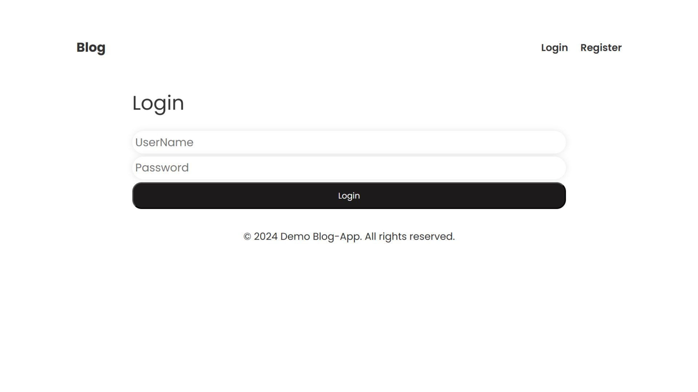
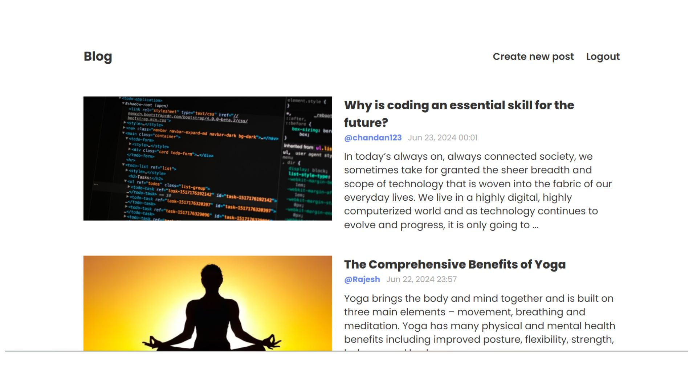
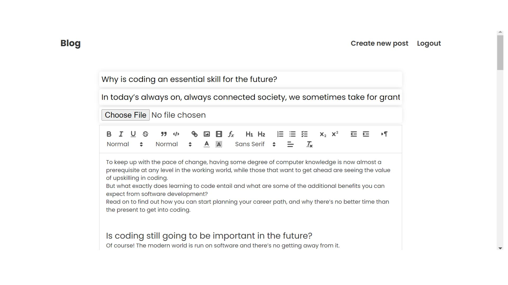

# Blog Application

## Overview
This is a full-stack blog application built with the MERN stack, focusing on CRUD operations. Users can register, log in, create, edit, and view blogs. 

## Features
- **User Authentication**: Secure login and registration functionality.
- **Blog Management**: Users can create, edit, and delete their blogs.
- **View Blogs**: All users can view blogs posted by other users.
- **Responsive UI**: Frontend built with React.js for a seamless user experience.
- **State Management**: Using Redux for efficient state management.
- **Backend**: Developed using Node.js and Express.js for robust server-side logic.
- **Database**: MongoDB for data storage.

## Screenshots





## Installation

### Prerequisites
- Node.js
- npm (Node Package Manager)
- MongoDB

### Frontend
1. Clone the repository:
    ```bash
    git clone https://github.com/chandankumarm55/Blog-React-Frontend.git
    ```
2. Navigate to the project directory:
    ```bash
    cd Blog-React-Frontend
    ```
3. Install dependencies:
    ```bash
    npm install
    ```
4. Start the development server:
    ```bash
    npm start
    ```
5. Open your browser and navigate to `http://localhost:3000`.

### Backend
1. Clone the repository:
    ```bash
    git clone https://github.com/chandankumarm55/blog-application-backend.git
    ```
2. Navigate to the project directory:
    ```bash
    cd blog-application-backend
    ```
3. Install dependencies:
    ```bash
    npm install
    ```
4. Set up environment variables:
    - Create a `.env` file in the root directory.
    - Add the following environment variables:
        ```env
        PORT=5000
        MONGO_URI=your_mongo_database_uri
        JWT_SECRET=your_jwt_secret
        ```
5. Start the server:
    ```bash
    npm start
    ```

## Usage
1. Ensure MongoDB is running on your system.
2. Start the backend server.
3. Start the frontend development server.
4. Open your browser and navigate to `http://localhost:3000`.

## Project Structure

### Frontend
- **React.js**: For building the user interface.
- **Redux**: For state management.
- **Axios**: For making HTTP requests to the backend.

### Backend
- **Node.js & Express.js**: For server-side logic and API endpoints.
- **MongoDB**: For database storage.
- **Mongoose**: For interacting with MongoDB.
- **JWT**: For authentication and secure data transfer.

